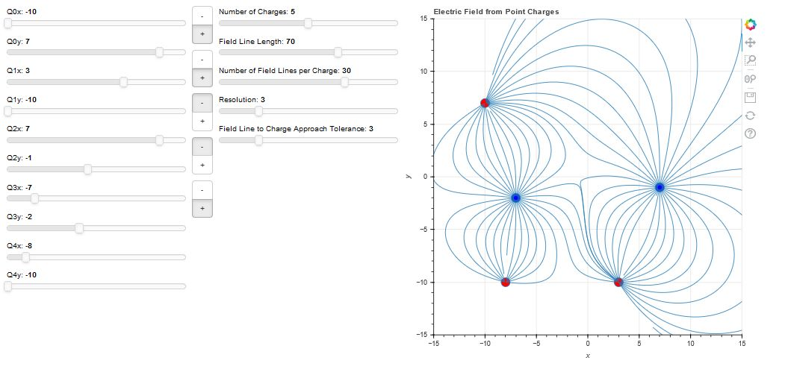

# Magnetia

Magnetia is a Physics field simulation framework under development.

## Usage

Currently Magnetia is usable only under [Poetry](https://python-poetry.org) this can be installed using `pip`:

```sh
pip install --user poetry
```

Install and setup the virtual environment by running at the root of the repository:

```sh
poetry install
```

## Electric Fields Simulation

The electric fields simulation is a web based application created using [Bokeh](https://bokeh.org/). The simulation plots electric charges and displays field
lines to illustrate the forces between them:



Launch the application by running:

```sh
poetry run bokeh serve --show magnetia/ui/efield.py
```
